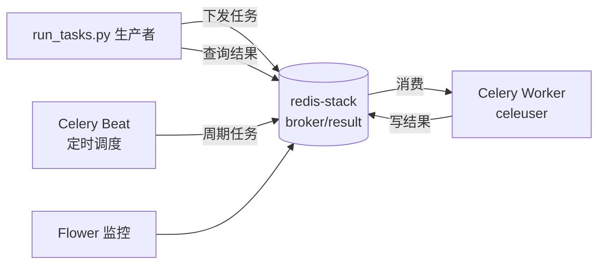

## Product Overview

从零创建一个基于 Docker 部署的生产级 Celery 应用 alt_celery3，作为任务平台（未来支撑高校学生管理系统后台），可执行生产者发出的普通任务与定时任务，任务易于扩展。

## Core Features

- Celery 应用骨架：任务以 py 文件形式放入独立子文件夹（tasks 目录），后续新增任务只需添加文件并注册
- 普通任务示例：简单加法任务（add）
- 定时任务示例：通过 celery beat 周期调度（如周期性加法/心跳任务）
- 独立脚本 run_tasks.py：调用所有示例任务（普通任务异步下发、等待结果），并查询/获取定时任务的执行结果
- Flower 监控服务：随应用一同安装并启动
- update.sh：拉取 GitHub 最新代码并重新构建/拉起 Docker 服务
- README.md：功能简介、部署过程与使用说明示例

## 技术约束

- Dockerfile 显式创建专用非特权用户 celeuser，celery 进程以该用户运行
- 使用外部已有的带密码 redis-stack 作为 broker 与 result backend，通过环境变量 CELERY_BROKER_URL / CELERY_RESULT_BACKEND 注入
- Python >= 3.13
- 同时提供现代 pyproject.toml 与传统 requirements.txt
- 代码注释使用 Google 风格 Docstring

## Tech Stack

- 语言：Python >= 3.13（基础镜像 python:3.13-slim）
- 任务框架：Celery 5.x（含 celery[redis]），beat 用于定时调度
- 监控：Flower
- 依赖管理：pyproject.toml（PEP 621，uv/pip 兼容）+ requirements.txt（锁定版本）
- 部署：Dockerfile（多阶段、非 root 用户 celeuser）+ docker-compose.yml（worker、beat、flower 三个服务）
- 消息中间件：外部 redis-stack（带密码），环境变量 CELERY_BROKER_URL / CELERY_RESULT_BACKEND

## Implementation Approach

- 采用经典 Celery 包结构：app 包内创建 celery 应用实例（autodiscover_tasks 自动发现 tasks 子包中的任务模块），任务文件全部放在 tasks/ 子文件夹，新增任务零侵入
- worker、beat、flower 分别以独立容器运行，共享同一镜像，通过 compose 定义；beat_schedule 在应用配置中集中定义，示例定时任务为周期性加法
- run_tasks.py 作为生产者端脚本，复用同一 celery app：下发普通任务并用 get() 等待结果；通过 AsyncResult 按 beat 任务每次执行生成的 task_id / 或直接查询 redis backend 结果获取定时任务历史结果
- 配置全部从环境变量读取（pydantic 或 os.environ），提供 .env.example，敏感信息不入库
- 性能与可靠性：prefetch 与并发数可配置；任务幂等、结果过期时间设置（result_expires）；healthcheck 校验 worker 存活；日志输出到 stdout 便于 docker logs 收集
- 安全：容器内以 celeuser 运行，镜像不缓存密钥，Redis 密码仅经环境变量注入

## Architecture Design



## Directory Structure Summary

```
alt_celery3/
├── app/                        # [NEW] Celery 应用包
│   ├── __init__.py             # [NEW] 导出 celery app 实例
│   ├── celery_app.py           # [NEW] 应用实例、配置（环境变量）、beat_schedule
│   └── tasks/                  # [NEW] 任务子包，后续新任务放此
│       ├── __init__.py         # [NEW] 空初始化
│       └── math_tasks.py       # [NEW] 加法任务 + 定时任务示例（Google 风格注释）
├── run_tasks.py                # [NEW] 生产者脚本：调用普通任务并等待结果、查询定时任务结果
├── pyproject.toml              # [NEW] 现代 PEP 621 依赖与元数据
├── requirements.txt            # [NEW] 传统依赖清单
├── Dockerfile                  # [NEW] python:3.13-slim 多阶段构建，创建 celeuser 非 root 用户
├── docker-compose.yml          # [NEW] worker / beat / flower 三服务编排
├── .env.example                # [NEW] CELERY_BROKER_URL / CELERY_RESULT_BACKEND 等环境变量示例
├── .dockerignore               # [NEW] 排除 .git、__pycache__ 等
├── .gitignore                  # [NEW] 排除 .env、__pycache__ 等
├── update.sh                   # [NEW] git pull 拉取最新代码并 docker compose 重建拉起
└── README.md                   # [MODIFY] 功能简介、部署过程、使用示例
```

## Key Code Structures

- celery_app.py：`app = Celery("alt_celery3")`，配置 broker/backend/result_expires/task_serialize=json 等，`app.autodiscover_tasks(["app.tasks"])`，`app.conf.beat_schedule` 定义示例周期任务
- math_tasks.py：`@app.task(name="tasks.add") def add(x, y)` 及一个被 beat 调度的定时任务
- run_tasks.py：`from app import celery_app`，`add.delay()` / `AsyncResult.get()`，并提供查询 beat 定时任务最近结果的函数